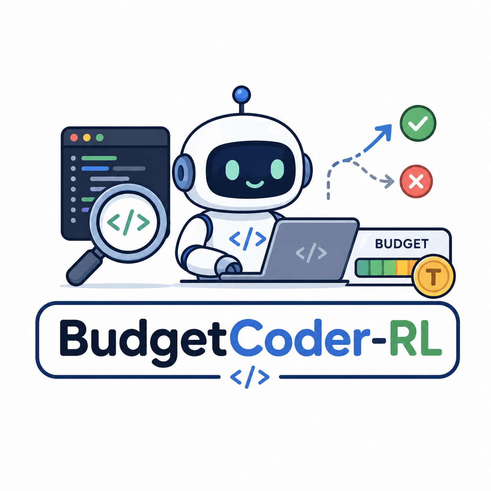

# BudgetCoder-RL


BudgetCoder-RL is an Agentic RL research prototype for **budget-aware repository exploration**. A coding agent receives a real software issue, a repository snapshot, a small set of exploration tools, and a **hard context budget**. It must search and read the repo over multiple turns, then submit the code locations it believes are relevant to the issue.

Stage 1 isolates **localization** from patch generation and test execution. The question is whether reinforcement learning can improve how a coding agent spends a limited exploration budget, not whether it can fully repair the bug.

## Status

`prototype / experiment`

This repository is an early Stage 1 slice. It is **not**:

- a complete SWE-bench repair agent
- a patch / test / debug loop
- an SFT or multi-agent scaffold
- a paper-ready or SOTA codebase

Training, evaluation, and installable package metadata are not locked yet.

## Stage 1 stack

Pinned starting point:

- Framework: [veRL](https://github.com/verl-project/verl) `main` @ `60546ef2a7464a158cd170f58f852a62a4e552ba` (`0.8.0.dev0`, pre-`v0.8.0`; sibling clone, not vendored). See `configs/versions/environment.md` for the exact pinned runtime.
- Algorithm: GRPO
- Parameter update: LoRA
- Model: `Qwen/Qwen3-4B-Instruct-2507`
- Data: SWE-Gym-derived localization tasks
- Budget: hard cumulative tool-observation token limit, plus a max-turn safety cap
- Reward: deterministic file/symbol F1 against hidden labels (no learned reward model)

Tool and environment tokens are observations. They must not contribute to the policy loss.

## Canonical entrypoints

```bash
# 1. Prepare the SWE-Gym localization dataset (frozen split is verify-only)
python scripts/data/prepare_swe_gym.py all

# 2. Train GRPO + LoRA (compute node; pinned conda env)
python scripts/train/train_grpo.py
python scripts/train/train_grpo.py --dry-run

# 3. Held-out localization eval (base and/or LoRA checkpoint × budgets)
python scripts/eval/evaluate_localization.py --phase all
python scripts/eval/evaluate_localization.py --dry-run
```

Configs:

- training: `configs/training/grpo_qwen3_4b.json`
- evaluation: `configs/evaluation/localization.json`
- agent: `configs/agent/repo_exploration.yaml`

Frozen scientific contracts and hashes: `docs/provenance.md`.

## Repository layout

```text
src/budget_coder_rl/   # core Python package
configs/               # training / evaluation / agent / historical provenance
scripts/               # data / train / eval / smoke entrypoints
data/                  # dataset lifecycle: manifests/fixtures in Git; raw/processed gitignored
docs/                  # provenance pins (not a results narrative)
tests/
```

Tabular datasets (e.g. official SWE-Gym parquet) live under `data/` and are gitignored. Repository snapshots, Docker / executable images, model weights, checkpoints, and full trajectories stay outside the Git tree, under `$BCRL_DATA_ROOT`. Nothing in `data/raw/` or `data/processed/` should be committed.

veRL is a pinned upstream sibling dependency, not part of this tree:

```text
<WORKSPACE_ROOT>/
├── budget-coder-rl/
└── deps/
    └── verl/
```

## Setup

The Stage 1 runtime is pinned in `configs/versions/environment.md` (veRL core =
upstream `main` @ `60546ef2`, Python 3.12 / torch 2.8.0+cu128 / vLLM 0.11.0 /
Ray 2.55.1 / Transformers 4.57.6).

1. Clone this repository.
2. Use a veRL checkout at the pinned commit as a sibling under `../deps/verl`
   (editable-installed into the RL conda environment).
3. Install this package without touching the RL environment:

```bash
pip install --no-deps -e .
```

4. Do not vendor veRL into this tree or silently upgrade veRL / vLLM / PyTorch / Transformers.

Smoke check (GPU node, pinned conda env):

```bash
python scripts/smoke/smoke_agent_loop.py --model-path <local-model-dir>
pytest tests/
```

## License

MIT. See [LICENSE](LICENSE).
